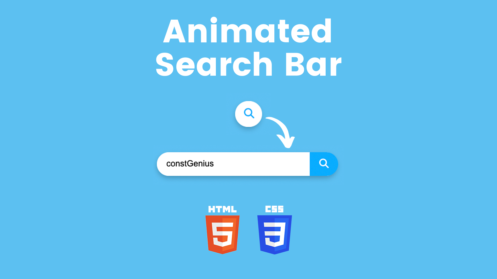

# Animated Search Bar Using HTML and CSS | Search Box Using HTML and CSS

The Animated Search Bar tutorial guides you through creating a sleek and interactive search box using only HTML and CSS. This project focuses on designing a modern search bar that features smooth animations and transitions, enhancing the overall user experience.

By utilizing HTML for the structure and CSS for styling and animation, you will learn how to create a visually appealing and functional search bar. The tutorial covers key CSS techniques such as transitions, transforms, and pseudo-elements to achieve the animated effect.

This project is perfect for beginners looking to enhance their web design skills and add dynamic elements to their websites, providing a professional and engaging interface for users.